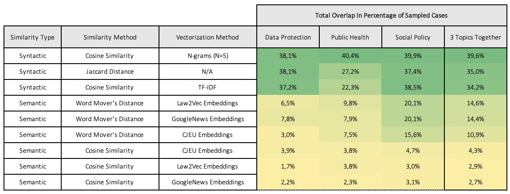
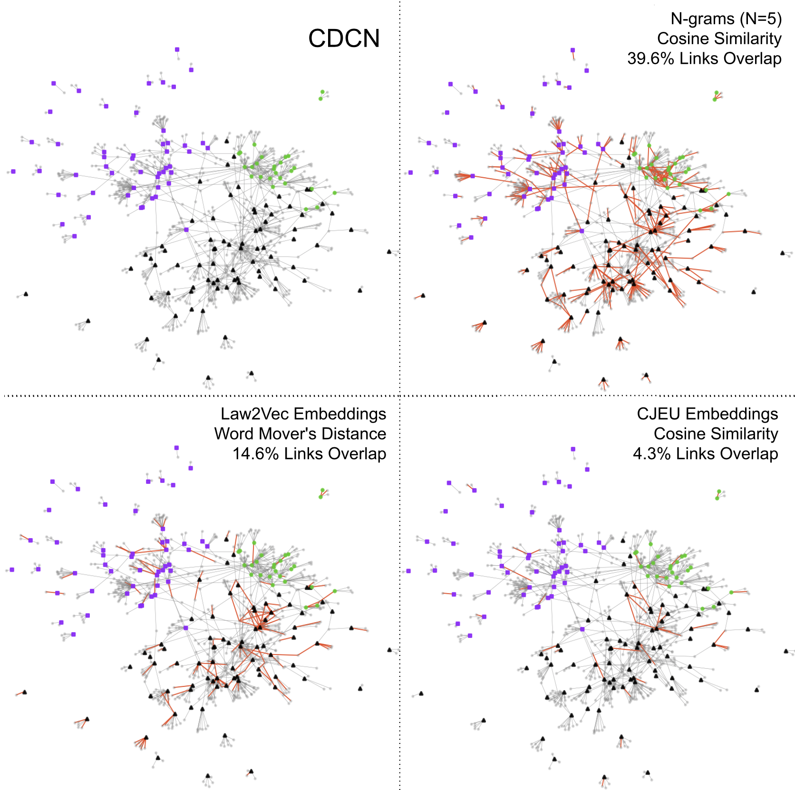

# Court Decision Text Similarity (CJEU judgements and orders)

A comparison of court decision citation behaviour with text similarity measures, applied to decisions by the Court of Justice of the European Union

